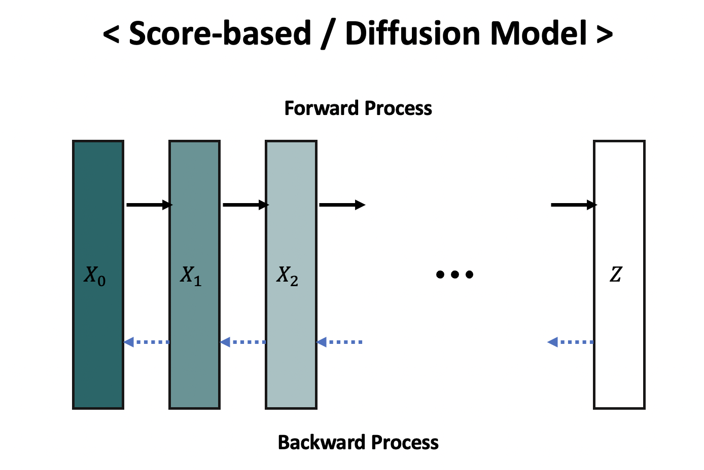

 

## 파이토치로 Scratch부터 시작하는 Score-based & Diffusion Model입니다.
- NCSN, NCSNv2, DDPM, DDPMv2, VESDE/VPSDE 와 같은 모델의 튜토리얼을 만들어 볼 예정입니다.
- 코드와 함께 블로그에 글을 정리할 예정입니다. 글과 함께 보시면 더 이해하기 쉬울 것입니다.
 
 

## What is Score-based Diffusion Model?
 

 

흔히 Score-based / Diffusion Model이라고 불리는 Diffusion-based Model은 일반적인 GAN과 VAE와 다른 생성모델입니다. 데이터에서 시작하여 Explict한 분포의 랜덤 노이즈로 수렴하는 Process를 정의해서 학습하고, 그 프로세스의 역방향을 이용해 Sampling하는 생성모델입니다. 하지만, Diffusion-based Model에 대한 진입장벽이 꽤 높은 편입니다. 그렇기 때문에 Diffusion-based Model에 대한 간단한 정리과 PyTorch 튜토리얼을 만들어보고자 합니다. 

 
 

## Content
 

| Model                                                        |                        Tutorial Code                         |                  Blog                   |                     Paper                     |                      Official Code                       |          Model Type          |
| ------------------------------------------------------------ | :----------------------------------------------------------: | :-------------------------------------: | :-------------------------------------------: | :------------------------------------------------------: | :--------------------------: |
| Generative Modeling by Estimating Gradients of the Data Distribution | [Link](https://github.com/JeongJiHeon/ScoreDiffusionModel/tree/main/NCSN) | [Link](https://ivdevlog.tistory.com/8)  | [Paper](https://arxiv.org/pdf/1907.05600.pdf) |       [GitHub](https://github.com/ermongroup/ncsn)       | Score-based Generative Model |
| Improved Techniques for Training Score-Based Generative Models |                                                              |                                         | [Paper](https://arxiv.org/pdf/2006.09011.pdf) |      [GitHub](https://github.com/ermongroup/ncsnv2)      | Score-based Generative Model |
| Denoising Diffusion Probabilistic Models                     | [Link](https://github.com/JeongJiHeon/ScoreDiffusionModel/tree/main/DDPM) | [Link](https://ivdevlog.tistory.com/14) | [Paper](https://arxiv.org/pdf/2006.11239.pdf) |   [GitHub](https://github.com/hojonathanho/diffusion)    |       Diffusion Model        |
| Improved Denoising Diffusion Probabilistic Models            |                                                              |                                         | [Paper](https://arxiv.org/pdf/2102.09672.pdf) |  [GitHub](https://github.com/openai/improved-diffusion)  |       Diffusion Model        |
| Score-based generative model through stochastic differential equation |                                                              |                                         | [Paper](https://arxiv.org/pdf/2011.13456.pdf) | [GitHub](https://github.com/yang-song/score_sde_pytorch) |        VESDE / VPSDE         |

## Contributor

- Jiheon, Jeong
  - [[GitHub]](https://github.com/JeongJiHeon) [[E-mail]](jeongjiheon.ai@gmail.com) [[Linkedin]](https://www.linkedin.com/in/JeongJiHeon)
- Yujin, Nam 
  - [[GitHub]](https://github.com/namyouth) [[E-mail]](skadb4513@gmail.com) [[Linkedin]](https://www.linkedin.com/in/yujin-nam-0a171a173)